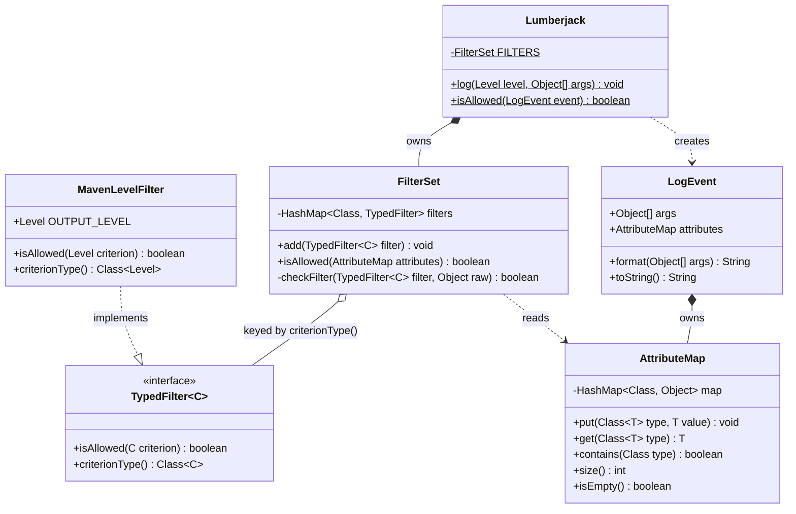
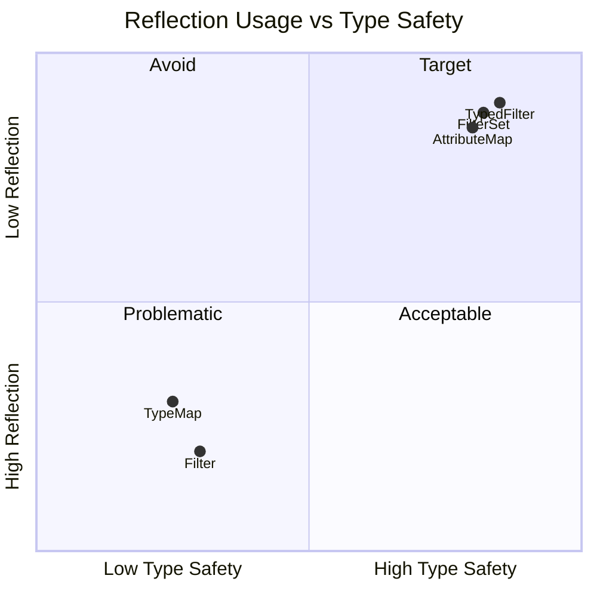
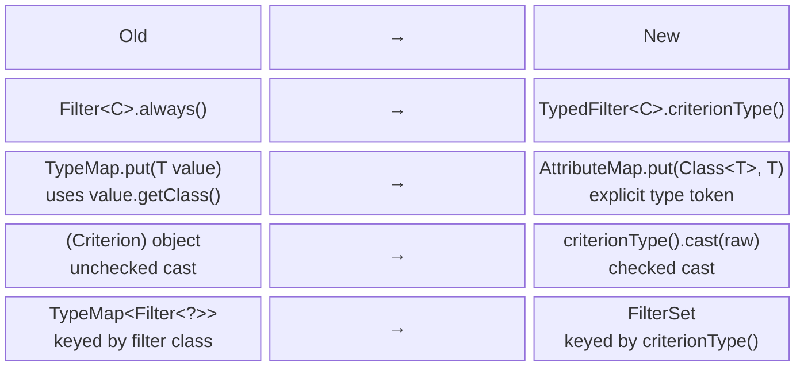

## Proposed Redesign: TypeMap and Filter

### Class Diagram

```mermaid
classDiagram
    direction TB

    class TypedFilter~C~ {
        <<interface>>
        +isAllowed(C criterion) boolean
        +criterionType() Class~C~
    }

    class AttributeMap {
        -HashMap~Class, Object~ map
        +put(Class~T~ type, T value) void
        +get(Class~T~ type) T
        +contains(Class type) boolean
        +size() int
        +isEmpty() boolean
    }

    class FilterSet {
        -HashMap~Class, TypedFilter~ filters
        +add(TypedFilter~C~ filter) void
        +isAllowed(AttributeMap attributes) boolean
        -checkFilter(TypedFilter~C~ filter, Object raw) boolean
    }

    class MavenLevelFilter {
        +Level OUTPUT_LEVEL
        +isAllowed(Level criterion) boolean
        +criterionType() Class~Level~
    }

    class LogEvent {
        +Object[] args
        +AttributeMap attributes
        +format(Object[] args) String
        +toString() String
    }

    class Lumberjack {
        -FilterSet FILTERS$
        +log(Level level, Object[] args) void$
        +isAllowed(LogEvent event) boolean$
    }

    MavenLevelFilter ..|> TypedFilter : implements
    FilterSet o-- TypedFilter : keyed by criterionType()
    FilterSet ..> AttributeMap : reads
    LogEvent *-- AttributeMap : owns
    Lumberjack *-- FilterSet : owns
    Lumberjack ..> LogEvent : creates
```

### Change Summary

```mermaid
quadrantChart
    title Reflection Usage vs Type Safety
    x-axis Low Type Safety --> High Type Safety
    y-axis High Reflection --> Low Reflection
    quadrant-1 Target
    quadrant-2 Avoid
    quadrant-3 Problematic
    quadrant-4 Acceptable
    TypedFilter: [0.85, 0.90]
    AttributeMap: [0.80, 0.85]
    FilterSet: [0.82, 0.88]
    Filter: [0.30, 0.20]
    TypeMap: [0.25, 0.30]
```

### Migration Table

```mermaid
block-beta
    columns 3
    old["Old"]:1 arrow["→"]:1 new["New"]:1

    b1["Filter&lt;C&gt;.always()"]:1
    b2["→"]:1
    b3["TypedFilter&lt;C&gt;.criterionType()"]:1

    c1["TypeMap.put(T value)\nuses value.getClass()"]:1
    c2["→"]:1
    c3["AttributeMap.put(Class&lt;T&gt;, T)\nexplicit type token"]:1

    d1["(Criterion) object\nunchecked cast"]:1
    d2["→"]:1
    d3["criterionType().cast(raw)\nchecked cast"]:1

    e1["TypeMap&lt;Filter&lt;?&gt;&gt;\nkeyed by filter class"]:1
    e2["→"]:1
    e3["FilterSet\nkeyed by criterionType()"]:1
```
