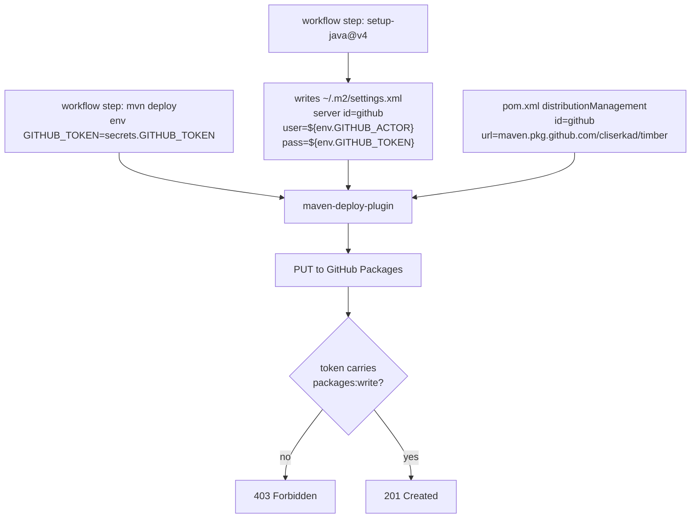

# maven-publish 403 from GitHub Packages

`.github/workflows/maven-publish.yml` fails at `scripts/deploy.sh` with HTTP 403 from
`https://maven.pkg.github.com/cliserkad/timber`.

## Authentication chain



## Verified facts

- `actions/setup-java@v4` always generates `~/.m2/settings.xml`; `configureAuthentication()` runs
  unconditionally from `configureMaven()` in `src/setup-java.ts`.
- Its defaults are `server-id: github`, username env var `GITHUB_ACTOR`, password env var
  `GITHUB_TOKEN` (`src/constants.ts`: `INPUT_DEFAULT_SERVER_USERNAME`, `INPUT_DEFAULT_SERVER_PASSWORD`).
  Omitting those inputs in the workflow is not a defect.
- The generated server id `github` matches `<distributionManagement><repository><id>github</id>` in
  `pom.xml`, so credentials attach to the deploy request.
- The registry URL owner/repo (`cliserkad/timber`) matches `git remote origin`, and the owner segment
  is lowercase, as the registry requires.
- `GITHUB_TOKEN` is exported on the `mvn deploy` step, which is the step that reads it.
- The workflow had no `permissions:` block.

## Potential causes, ranked

### 1. GITHUB_TOKEN lacks `packages: write` (fix applied)

The workflow declared no `permissions:`, so the job inherited the repository default. Repositories and
organizations created after the default changed receive **read** contents and packages only. An
authenticated request with a read-scoped token is exactly what produces 403 rather than 401.

The published example workflow in GitHub's own Maven publishing tutorial differs from this repo's
workflow in one respect only: it declares

```yaml
permissions:
  contents: read
  packages: write
```

A job-level `permissions:` block raises the token above the repository default, so this fix works
without changing repository settings. `maven-publish.yml` now declares it.

### 2. Run triggered by Dependabot

The most recent pushes to `main` are Dependabot version bumps. Workflow runs attributed to
`dependabot[bot]` receive a read-only `GITHUB_TOKEN` and read from the Dependabot secret store rather
than the Actions secret store. Confirm the failing run's actor before concluding that cause 1 is the
whole story.

### 3. Package not linked to this repository

GitHub Packages binds each package to one repository. If `xyz.cliserkad.timber-core`,
`xyz.cliserkad.timber-parent`, or `xyz.cliserkad.timber-maven-plugin` already exists in the registry
bound to a different repository, or was first published with a personal access token outside Actions,
the repository-scoped `GITHUB_TOKEN` is refused with 403.

Check: package page -> Package settings -> Manage Actions access -> the `timber` repository must be
listed with the Write role.

### 4. Repository or organization Actions policy

Settings -> Actions -> General -> Workflow permissions set to "Read repository contents and packages
permissions" is the settings-level form of cause 1. Fixing cause 1 in the workflow covers it. A
separate organization policy restricting package creation is not overridable from the workflow.

### 5. Credentials never attached

Anonymous requests to `maven.pkg.github.com` answer 403, not 401, so a 403 does not by itself prove
the token reached the registry. This is ruled unlikely by the verified facts above, but confirm from
the run log:

- the setup-java step prints a line naming the generated settings file and server id
- the deploy step's Maven output names `github` as the repository id in the transfer failure

If `settings-path` or `overwrite-settings: false` were ever added to the workflow, Maven would send no
credentials and the failure would look identical.

## Ruled out

- **Server id mismatch.** Generated id and `distributionManagement` id are both `github`.
- **Wrong registry URL.** Owner and repository match the remote; owner is lowercase.
- **Version collision.** `scripts/common.sh` derives `revision` from `git log -1 --format=%ct`, unique
  per commit. A re-run of an already published commit collides, but the registry answers 409 for that,
  not 403.
- **Missing `GITHUB_TOKEN` on the step.** It is present on the step that runs Maven.

## Verification

The 403 is confirmed resolved only by a publish run reaching the registry. Watch for:

- the deploy step uploading each of `timber-parent`, `timber-core`, `timber-maven-plugin`
- the packages appearing under the `timber` repository

If 403 persists after the permissions block is in place, cause 1 is not the whole story; work through
causes 2, 3 and 4 in order, starting from the failing run's actor.
